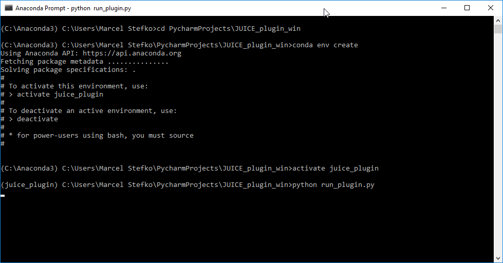
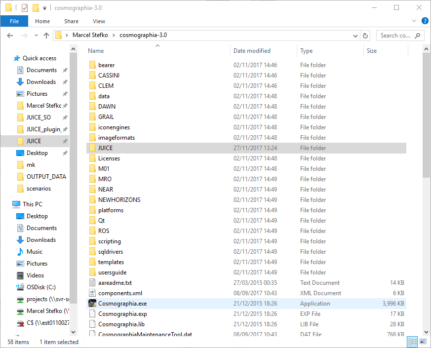
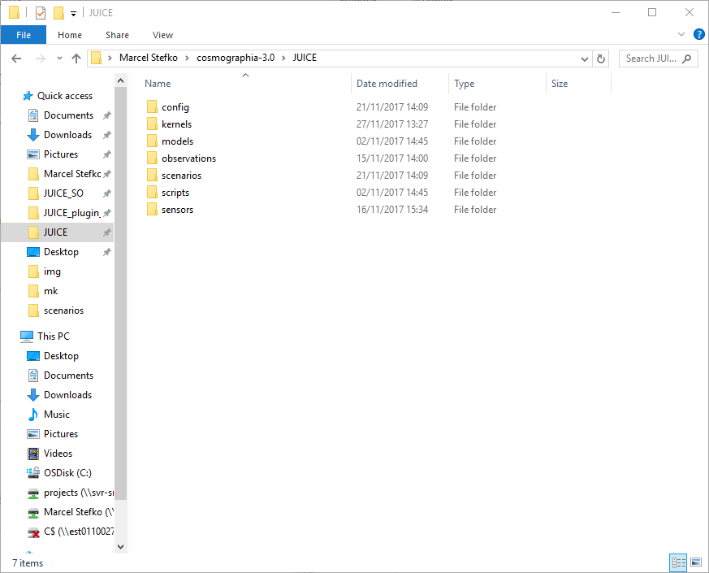
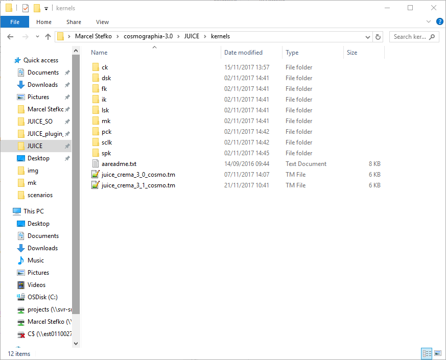
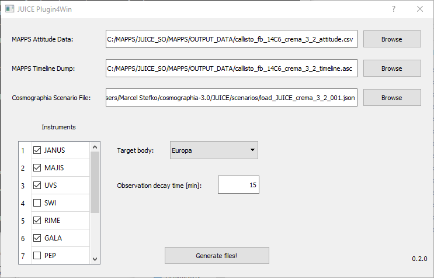
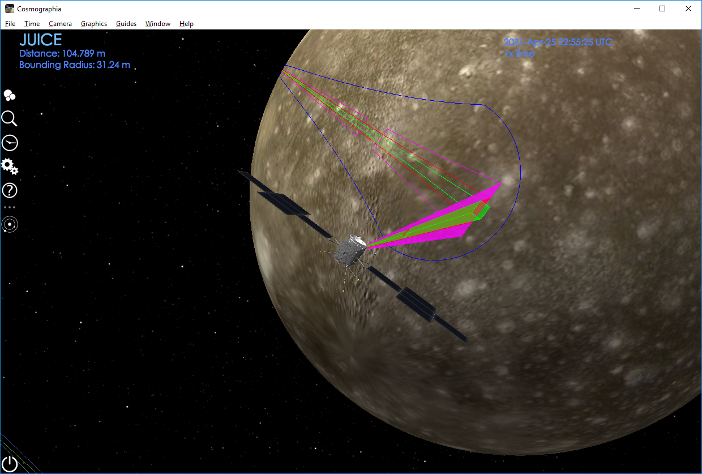

# JUICE Cosmographia Conversion Plugin 

This plugin allows you to import MAPPS data (attitude + instrument operation) as a Cosmographia scenario.

## Installation
This plugin requires `python2.7` with packages `pyqt5`, `jdcal`, and `simplejson` installed.

If you use Anaconda, you can install using these steps:

 1. Open Anaconda prompt, and navigate to root folder of this plugin `JUICE_plugin_win`.
 2. `conda env create` (This creates a new environment called `juice_plugin` with all 
 required packages and correct Python version.)
 3. `activate juice_plugin` (This activates the newly-created environment.)
 4. `python run_plugin.py` (The GUI should be displayed now.)
 

**Fig 1: Correct installation procedure.**

For subsequent runs, you need to `activate juice_plugin` environment every time you restart Anaconda prompt.

## Preparing Cosmographia
You need to have [Spice-enhanced Cosmographia](https://www.cosmos.esa.int/web/spice/cosmographia) with the appropriate
[JUICE datafiles](ftp://spiftp.esac.esa.int/cosmographia/missions/) correctly installed (see
[aareadme.txt](ftp://spiftp.esac.esa.int/cosmographia/missions/aareadme.txt) for installation instructions).

 - Latest kernels can be downloaded [here](ftp://spiftp.esac.esa.int/data/SPICE/JUICE/). Remember to change the
  `PATH_VALUES` entry in the metakernels to correct path, e.g. `'<cosmographia_root>\JUICE\kernels'`
    - `<cosmographia_root>` is the folder in which your `Cosmographia.exe` is located, e.g. `C:\cosmographia-3.0`. This folder should also be included in your system's `PATH` environment variable (this is done automatically
    when Cosmographia is installed, if you get a warning about the `PATH` variable while using this program,
    this [google search](https://www.google.nl/search?q=how+to+add+folder+to+path+windows) might help you fix
    the issue).
 - Note: As of 27th November 2017, the above Cosmographia SPICE datafiles do not contain catalog files for JUICE CREMA3.2. You will need to create them manually:
    - In `JUICE/config/`, modify `spice_JUICE_crema_3_1.json` by pointing the `"spiceKernels"` entry to the correct CREMA3.2 metakernel in `../kernels/` or `../kernels/mk/` directory. Save this new file as `spice_JUICE_crema_3_2.json`.
    - In `JUICE/scenarios/`, modify `load_JUICE_crema_3_1_001.json` by changing the first `"require"` entry to `"../config/spice_JUICE_crema_3_2.json"` (i.e. point to the file you just created). Save as `load_JUICE_crema_3_2_001.json`.

**Fig 2: Correct placement of JUICE datafiles inside Cosmographia root directory.**

**Fig 3: Correct placement of JUICE SPICE folders inside Cosmographia/JUICE directory.**

**Fig 4: Correct placement of JUICE SPICE kernels inside Cosmographia/JUICE/kernels directory.**

## Usage

**Fig 5: Main plugin GUI.**

The program requires input of 3 data files:

 1. `MAPPS Attitude Data`: This is a MAPPS `.csv` file created using 
`MAPPS -> Data -> Generate Datapack -> Quaternions+AttitudeMatrix`. It contains
required quaternion data for generating a new CK kernel.
 2. `MAPPS Timeline Dump`: This is a MAPPS `.asc` file created using
`MAPPS -> Data -> Dump Timeline Data...`. It contains information about instrument
activity.
 3. `Cosmographia Scenario File`: This is a `.json` file that you would normally use to load
a JUICE Cosmographia scenario without any observations (i.e. only to display JUICE's trajectory).
This file should reside in `<cosmographia_root>/JUICE/scenarios/` folder if you followed kernel installation
instructions correctly.

 
 - You can customize which instrument operations will be displayed using the checkboxes.
 - `Target body` specifies which body is used to display instrument ground tracks. For moon flybys,
use the appropriate moon.
 - `Observation decay time [min]` specifies time duration for which 
 the ground track of an observation
 is still displayed, after the observation's end time.

To generate a scenario, click `Generate files!`. A `<cosmographia_root/JUICE/mapps_output_yyyymmdd_HHMMSS/`
folder will be created. Inside this folder all necessary files are stored. The original
files are not modified by this script.

To launch this scenario, there are three options:

 1. Launch immediately by selecting `Close program and launch scenario` option in the dialog that appears after
 the scenario is generated (this runs the `run_scenario.bat` script in the output folder). This option will only
 appear if all data files are correctly structured within the `<cosmographia_root>/JUICE` folder.
 2. Run the `run_scenario.bat` script in the output folder manually. This automatically finds JUICE and sets time of first observation.
 3. Launch Cosmographia, go to `Cosmographia -> File -> Open Catalog...`, and open the `<cosmographia_root/JUICE/mapps_output_yyyymmdd_HHMMSS/LOAD_SCENARIO.json`
file. You need to set the time of interest and find JUICE manually, using Cosmographia's controls.

**Fig 6: Cosmographia with running generated scenario.**

## Configuration
Some settings can be adjusted in `juice_plugin.ini` in the `[itl]` section:
- `mode_sensors`: This dictionary defines which instrument modes are considered "on" states, and which
sensor FOV is associated with each mode. Each entry has the format `"instrument_mode": "sensor_fov_name"`.
- `instruments`: This is a list of instrument names which become selectable in the GUI.
- `sensor_colors`: This dictionary defines for each instrument an `RGB` color which is used to display
sensor FOVs and ground tracks.

## Issues
- Please report any issues to [Marcel Stefko](mailto:marcel.stefko@esa.int)

## Troubleshooting
- Script runs fine, but Cosmographia displays `Error loading kernel: <kernel path>...`?
    - Make sure that the `PATH_VALUES` variable in the given kernel is correctly set.

## Acknowledgements
- This script is based on Rafael Andres' JUICE plugin for Linux and Mac.
