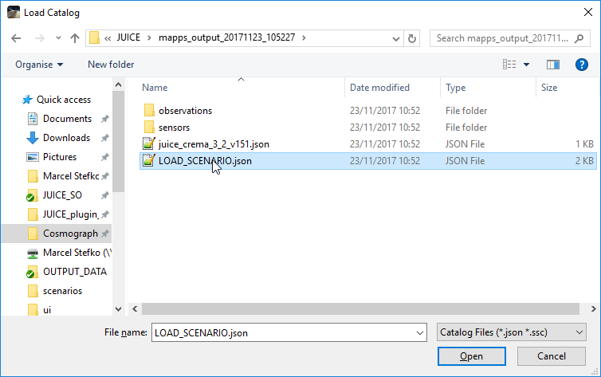

# JUICE Cosmographia Conversion Plugin 

This plugin allows you to import MAPPS data (attitude + instrument operation) as a Cosmographia scenario.

## Installation
This plugin requires `python2.7` with packages `pyqt5` and `simplejson` installed.

If you use Anaconda, you can install using these steps:
 1. Open Anaconda prompt, and navigate to root folder of this plugin `JUICE_plugin_win`.
 2. `conda env create` (This creates a new environment called `juice_plugin` with all 
 required packages and correct Python version.)
 3. `activate juice_plugin` (This activates the newly-created environment.)
 4. `python run_plugin.py` (The GUI should be displayed now.)
 

For subsequent runs, you need to `activate juice_plugin` environment every time you restart Anaconda prompt.

## Usage
The program requires input of 3 data files:
1. `MAPPS Attitude Data`: This is a MAPPS `.csv` file created using 
`MAPPS -> Data -> Generate Datapack -> Quaternions+AttitudeMatrix`. It contains
required quaternion data for generating a new CK kernel.
2. `MAPPS Timeline Dump`: This is a MAPPS `.asc` file created using
`MAPPS -> Data -> Dump Timeline Data...`. It contains information about instrument
activity.
3. `Cosmographia Scenario File`: This is a `.json` file that you would normally use to load
a JUICE Cosmographia scenario without any observations (i.e. only to display JUICE's trajectory).
This file should reside in `../JUICE/scenarios` folder.

- You can customize which instrument operations will be displayed using the checkboxes.
- `Target body` specifies which body is used to display instrument ground tracks. For moon flybys,
use the appropriate moon.
- `Observation decay time [min]` specifies time duration for which 
the ground track of an observation
is still displayed, after the observation's end time.

To generate a scenario, click `Generate files!`. A `mapps_output_yyyymmdd_HHMMSS` folder will be created
in the Cosmographia `JUICE/` directory. Inside this folder all necessary files are stored. No
other files are modified by this script.

To launch this scenario, there are three options:

 1. Launch immediately by selecting `Close & launch Cosmographia` option in the dialog that appears after
 the scenario is generated (this runs the `run_scenario.bat` script in the output folder).
 2. Run the `run_scenario.bat` script manually. This automatically finds JUICE and sets time of first observation.
 3. Launch Cosmographia, go to `Cosmographia -> File -> Open Catalog...`, and open the `LOAD_SCENARIO.json`
file. You need to set the time of interest and find JUICE manually, using Cosmographia's controls.

## Configuration
Some settings can be adjusted in `juice_plugin.ini` in the `[itl]` section:
- `mode_sensors`: This dictionary defines which instrument modes are considered "on" states, and which
sensor FOV is associated with each mode. Each entry has the format `"instrument_mode": "sensor_fov_name"`.
- `instruments`: This is a list of instrument names which become selectable in the GUI.
- `sensor_colors`: This dictionary defines for each instrument an `RGB` color which is used to display
sensor FOVs and ground tracks.

## Issues

- Plugin doesn't support multiple instruments having the same name for a mode (e.g. two instruments can't
have a mode with the same name, such as `SCIENCE_20pct`.

