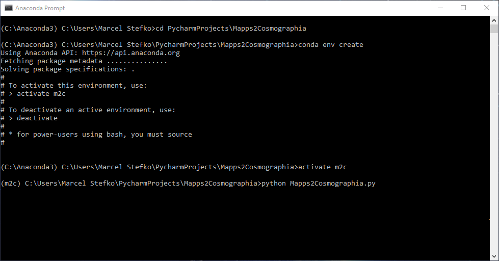
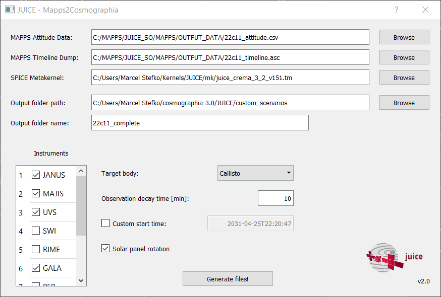

# MAPPS to Cosmographia Converter

This plugin allows you to import JUICE MAPPS data (attitude + instrument operation) as a Cosmographia scenario.

## Preparing Cosmographia
In short, you need to set up [Spice-enhanced Cosmographia](https://www.cosmos.esa.int/web/spice/cosmographia),
and correctly install [JUICE datafiles](ftp://spiftp.esac.esa.int/cosmographia/missions/) so that you can run
the "stock" scenarios included in the `<cosmographia_root>/JUICE/scenarios/` folder.

See Marc Costa's [SETUP GUIDE](ftp://spiftp.esac.esa.int/cosmographia/missions/aareadme.txt) for detailed instructions.
You need to follow all steps in the 'A very short introduction to SPICE-Enhanced Cosmographia Setup' section,
so that following conditions are met:
 1. [JUICE datafiles](ftp://spiftp.esac.esa.int/cosmographia/missions/) are placed under `<cosmographia_root>\JUICE` folder, i.e. e.g. `C:\Users\Marcel Stefko\cosmographia-3.0\JUICE\scenarios` is a valid file path.
 2. [JUICE kernels](ftp://spiftp.esac.esa.int/data/SPICE/JUICE/misc/release_notes/juice_ftp_160.txt) are downloaded, with `PATH_VALUES` set correctly in each metakernel.
 3. `spice_JUICE_crema_xxx.json` files in `<cosmographia_root>/JUICE/config/` folder are modified so that the 'spiceKernels' entries point to the corresponding metakernels
 from point 2. Backslashes in Windows-style filepaths **must** be escaped, e.g. `C:\\Users\\Marcel Stefko\\SPICE\\kernels\\mk\\juice_crema_3_2_v151.tm`.

## Installation
### As standalone program (EXPERIMENTAL)
 1. Unzip `Mapps2Cosmographia.zip` into any directory.
 2. Run `Mapps2Cosmographia.exe`.

### As python script
This plugin requires `python3` with packages `pyqt5`, `jdcal`, and `simplejson` installed.

If you use Anaconda, you can install using these steps:

 1. Open Anaconda prompt, and navigate to root folder of this plugin `Mapps2Cosmographia`.
 2. `conda env create` (This creates a new environment called `m2c` with all
 required packages and correct Python version.)
 3. `activate m2c` (This activates the newly-created environment.)
 4. `python Mapps2Cosmographia.py` (The GUI should be displayed now.)
 

**Fig 1: Correct installation procedure.**

For subsequent runs, you need to `activate m2c` environment every time you restart Anaconda prompt.

## Usage

**Fig 5: Main plugin GUI.**

The program requires input of 3 data files:

 1. `MAPPS Attitude Data`: This is a MAPPS `.csv` file created using 
`MAPPS -> Data -> Generate Datapack -> Quaternions+AttitudeMatrix`. It contains
required quaternion data for generating a new CK kernel.
 2. `MAPPS Timeline Dump`: This is a MAPPS `.asc` file created using
`MAPPS -> Data -> Dump Timeline Data...`. It contains information about instrument
activity.
 3. `Cosmographia Scenario File`: This is a `.json` file that you would normally use to load
a JUICE Cosmographia scenario without any observations (i.e. only to display JUICE's trajectory).
This file should reside in `<cosmographia_root>/JUICE/scenarios/` folder if you followed installation
instructions correctly.

 
 - You can customize which instrument operations will be displayed using the checkboxes.
 - `Target body` specifies which body is used to display instrument ground tracks. For moon flybys,
use the appropriate moon.
 - `Observation decay time [min]` specifies time duration for which 
 the ground track of an observation
 is still displayed, after the observation's end time.
 - `Custom start time` allows manually specifying the simulation time at which the scenario is launched.
 The timestamp must be in ISO8601 format without the ending `Z`, i.e. `yyyy-mm-ddTHH:MM:SS`

To generate a scenario, click `Generate files!`. A `<cosmographia_root>/JUICE/mapps_output_yyyymmdd_HHMMSS/`
folder will be created. Inside this folder all necessary files are stored. The original
files are not modified by this script.

To launch this scenario, there are three options:

 1. Launch immediately by selecting `Launch scenario` option in the dialog that appears after
 the scenario is generated (this runs the `run_scenario.bat` script in the output folder). This option will only
 appear if all data files are correctly structured within the `<cosmographia_root>/JUICE` folder.
 2. Run the `run_scenario.bat` script in the output folder manually. This automatically finds JUICE and sets time of first observation.
 3. Launch Cosmographia, go to `Cosmographia -> File -> Open Catalog...`, and open the `<cosmographia_root/JUICE/mapps_output_yyyymmdd_HHMMSS/LOAD_SCENARIO.json`
file. You need to set the time of interest and find JUICE manually, using Cosmographia's controls.

**Fig 6: Cosmographia with running generated scenario.**

## Configuration
Some settings can be adjusted in `config_static.ini` in the `[itl]` section (make sure you adhere to the JSON format specification, otherwise errors will occur):

- `mode_sensors`: This dictionary defines which instrument modes are considered "on" states, and which
sensor FOV is associated with each mode. It is organised by instrument name, where for each instrument you have its own dictionary. Each entry of this dictionary has the format `"instrument_mode": "sensor_fov_name"`.
- `sensor_colors`: This dictionary defines for each instrument an `RGB` color which is used to display
sensor FOVs and ground tracks.

## Issues
- Please report any issues to [Marcel Stefko](mailto:marcel.stefko@esa.int)

## Troubleshooting
- Script runs fine, but Cosmographia displays `Error loading kernel: <kernel path>...`?
    - Make sure that the `PATH_VALUES` variable in the given kernel is correctly set.
- The script doesn't start up correctly.
    - Check the `config_static.ini` and `config_temp.ini` files, if their content seems corrupted, replace them with original ones from the repository.

## Acknowledgements
- This script is based on Rafael Andres' JUICE plugin for Linux and Mac.
